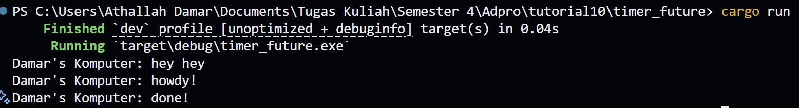

# Module 10 Adpro Timer Reflection

Nama: Athallah Damar Jiwanto  
NPM: 2306245024  
Kelas: Advprog-B

## Experiment 1.2: Understanding how it works.

Output yang pertama kali muncul adalah `"hey hey"`, kemudian diikuti oleh `"howdy!"` dan `"done!"`. Hal ini terjadi karena `println!("Damar's Komputer: hey hey")` dieksekusi langsung oleh thread utama sebelum executor dijalankan. Sementara itu, `spawner.spawn(...)` hanya menambahkan task ke dalam queue, dan task tersebut baru diproses setelah `executor.run()` dipanggil. Di dalam task, output `"howdy!"` akan muncul terlebih dahulu, lalu setelah jeda dua detik dari TimerFuture, barulah muncul `"done!"`.
