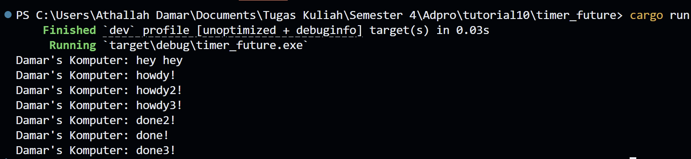
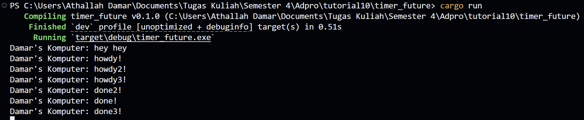

# Module 10 Adpro Timer Reflection

Nama: Athallah Damar Jiwanto  
NPM: 2306245024  
Kelas: Advprog-B

## Experiment 1.2: Understanding how it works.

Output yang pertama kali muncul adalah `"hey hey"`, kemudian diikuti oleh `"howdy!"` dan `"done!"`. Hal ini terjadi karena `println!("Damar's Komputer: hey hey")` dieksekusi langsung oleh thread utama sebelum executor dijalankan. Sementara itu, `spawner.spawn(...)` hanya menambahkan task ke dalam queue, dan task tersebut baru diproses setelah `executor.run()` dipanggil. Di dalam task, output `"howdy!"` akan muncul terlebih dahulu, lalu setelah jeda dua detik dari TimerFuture, barulah muncul `"done!"`.

## Experiment 1.3: Multiple Spawn and removing drop.

Dengan multiple spawn ini task berlajan secara bersamaan. Dimana terlihat `"done!"` terjadi setelah `"done2!"`, yang mana urutannya terbalik jika kita liat di codenya. Alhasil semua task tersebut dapat selesai dengan urutan yang tidak selalu sama.

Setelah kita menghapus `drop(spawner)`, terlihat program masing berjalan. Hal tersebut disebabkan spawner kita terus menunggu untuk mengeksekusi tugas, yang mana dengan `drop(spawner)` kita bisa memberitahu `executor` bahwa sudah tidak ada tugas yang ada sehingga program bisa langsung distop.